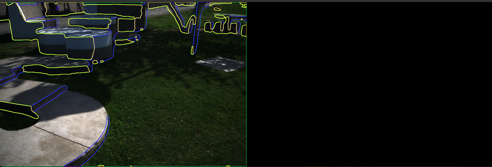
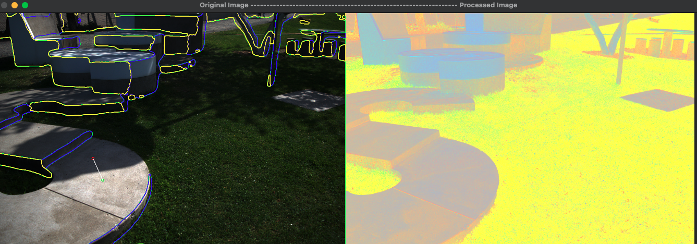
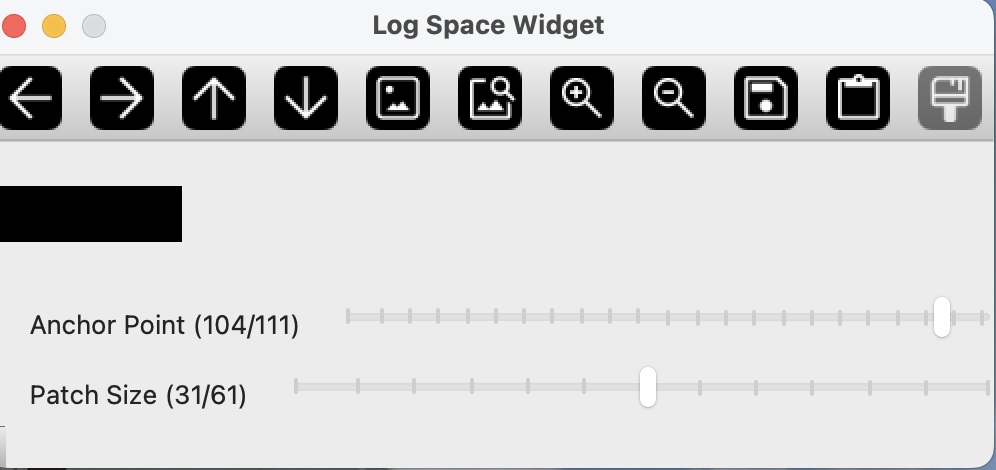
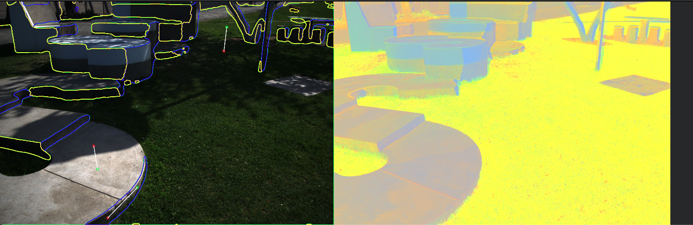

## Depth Aware Image Annotator

This program allows users to annotate images and process them in real-time into log chromaticity space.

It computes a pixel-wise Illuminant Spectral Direction (ISD) map using ISD estimates derived from each annotation location. Each pixel’s ISD value is weighted based on its distance to the lit annotation (marked by a green circle) of the lit-shadow annotation pair.

To aid the annotation process, the program overlays contours corresponding to surface normal segments. These are computed from an instance of the DepthAnythingV2 model. Annotations belonging to the same segment (or cluster) apply depth-weighted ISD values to nearby pixels within that segment. Any segment that lacks annotations will be assigned the global mean ISD computed from all provided annotation pairs.

Ensure that each lit-dark annotation pair lies within the same (not necessarily contiguous) segment.

The program does not save the processed chromaticity image directly.

Instead, it can save an ISD map for each image as a .tiff file. These ISD maps can later be used to regenerate shadow-free images during downstream processing.

Note: ISD values are scaled by 65535 when saved. To use them, divide the .tiff values by 65535 and convert them to float format.

Finally, annotations for each image are saved to annotations.xml, which can be used to regenerate ISD maps or for other downstream tasks.

### Requirements

This project requires the following Python packages:

- `opencv-python` (for image processing)
- `tifffile` (for handling TIFF images)
- `numpy` (for numerical operations)
- `pathlib` (for working with file system paths)
- `xml.etree.ElementTree` (for parsing and working with XML files)
- `xml.dom.minidom` (for pretty-printing XML data)
- `argparse` (for command-line argument parsing)

You can install the required dependencies by running the following command in your Python environment:

```bash
pip install -r requirements.txt
```

### Usage Instructions:
### ```Step 1```
**Set Up**
Clone the repo or download the following files:
```bash
git clone https://github.com/mmkke/isd-annotator.git
cd isd-annotator/
```

**Get Depth Anything Model Checkpoint**

This project uses the Depth Anything V2 model for estimating surface normals from RGB images.

You can download a pretrained checkpoint for DepthAnythingV2 (e.g., for the vit-s model) directly using wget or manually.

Save model checkpoint to: ```src/depth_anything_v2/checkpoints```

* [DepthAnythingV2 GitHub](https://github.com/DepthAnything/Depth-Anything-V2)  
* [Depth-Anything-V2-Small](https://huggingface.co/depth-anything/Depth-Anything-V2-Small/resolve/main/depth_anything_v2_vits.pth?download=true)

```bash
  mkdir -p src/depth_anything_v2/checkpoints

  wget https://huggingface.co/isl-org/Depth-Anything/resolve/main/depth_anything_v2_vits14.pth \
      -O src/depth_anything_v2/checkpoints/depth_anything_v2_vits14.pth
```

### ```Step 2```
**Prepare your folder**:
   - Ensure that your images are placed inside a new folder with a name you will specify when running the script.
   - The folder ```example_folder``` contains several example images that can be used for testing the annotator.
   - The folder should be located inside the ```images``` directory and structured like so:
     ```
     images/
       └── {folder_name}/
             └── image1.tiff
             └── image2.tiff
             └── ...
     ```

Setting the file structure in this way allows for current pathing implementation to execute. Alternatively, the pathing setup can be modified in ```annotator_driver.py``` to the user specifications.

### ```Step 3```
**Running the Script**:
   - Open a terminal or command prompt in the directory containing the Python script.
   - To run the script, use the following command format:
     ```bash
     python src/annotator_driver.py {folder_name}
     ```
     Replace `{folder_name}` with the name of the folder that contains the images to be annotated. For example:
     ```bash
     python src/annotator_driver.py folder_5
     ```
     To save ISD pixel maps as ```.tiff``` in ```/annotations/{folder_name}/isd_maps/```. For example:
     ```bash
     python src/annotator_driver.py folder_5 --save_map
     ```

### ```Step 4```
**GUI**

This GUI will appear (style of GUI may vary depending on your OpenCV GUI backend):




### ```Step 5```
**Annotate the image**

**Annotation Functionality:**
* ***Clicks***
  * ```left click:``` Adds an annotation.
  * ```right click``` Remove a single annotation.
* ***Key strokes***
  * ```r``` Start over; removes all annotations.

**Important Notes:**
1. Make annotations in the following order:
   1. Lit region
   2. Shadow region
2. Each annotation pair should be on the same material.
3. Each pair should lie within the same surface normal segment.

Annotations will be displayed on the original image as they are made. The green circles are the lit annotations and red circles are the dark annotations.



The program will automatically process the image.

___ 



Adjust the patch size and anchor point with the trackbars in this window. Patch size will modify the computation of the ISD and often improves performance.  

Adjusting anchor point does NOT actually change the ISD computation, but aids the user in visually inspect results.
___ 
Add annotations, adjusting patch size and anchor point until satisfied with results.



### ```Step 6```
**Save Annotation**

* ***Key Strokes***
  * ```Enter```: Save results.
  * ```Space```: Drop image, to be used when image is unsuitable or unable to achieve quality annotations.

* If ```Enter``` is chosen, an ISD map for the current image (```tiff```) will saved to the ```isd_maps``` folder.
* ```annotations.xml``` will be updated with annotation coordinates, patch size, and anchor point for the current image.

Once all images have been processed the program terminates.

**Quitting Functionality:**  

* ***Key Strokes***
  * ```q```: The user can quit and restart the current image at any time.

### ```Results```

The program will create directories and files to store the results. Processing an image folder will result in the following file/folder structure.

```
base_directory/
├── annotations
│       ├── folder_1
│           ├── isd_maps/
│                  ├── img_1_isd.tiff
│                  ├── ...
│                  └── img_n_isd.tiff
│           └── annotations.xml
│       ├── folder_2
│       └── folder_3
├── images
|     └── folder_1
│           ├── img_1.tiff
│           ├── ...
│           └── img_n.tiff
│       ├── folder_2
│       └── folder_3
├── image_annotator/
│       ├── annotator_class.py
│       ├── image_processor_class.py
│       └── annotator_driver.py.csv
```

**Files**  
```annotations.xml```:  Contains the image file name, annotation coordinates, patch size, and anchor point for all images.
 
**Folders**  
```annotations```: Contains sub directories for an annotations.xml file and isd_maps directory for saving isd map .tiff files.   
```images```: Contains sub directories with images for annotation. 
```src```: Contains annotator_driver.py and necessary classes for annotation. 