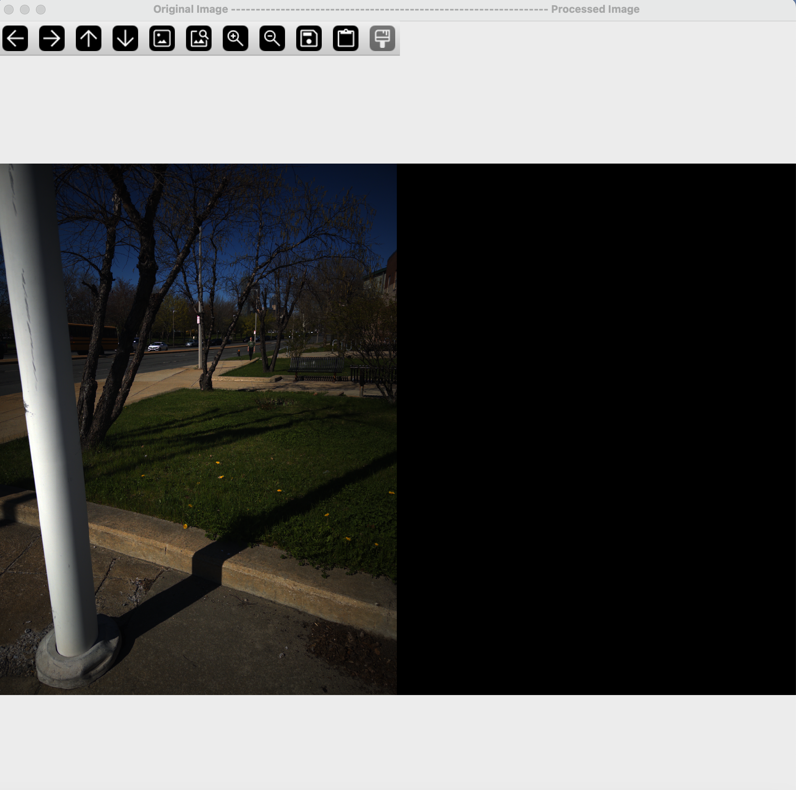

## Image Annotator

This program will allow a user to annotate images and processes the images in real-time into log chromaticity space.

The program computes a localized ISD based on the weighted mean of the ISDs computed at each annotation location. Weights are determined by the distance from each pixel to the center of the line connecting the lit and shadow pairs.

The program does NOT save a processed image.

Rather, the program saves an ISD map for each processed image stored as a 16-bit ```tiff```. The processed image (shadow-free) can regenerated by processing images using the saved ISD map.

Prior to saving the ISD map, values are multiplied by 65535.

To use the ISD maps downstream, map the ISD map to a float and divide by 65535.

### Requirements

This project requires the following Python packages:

- `opencv-python` (for image processing)
- `tifffile` (for handling TIFF images)
- `numpy` (for numerical operations)
- `pathlib` (for working with file system paths)
- `xml.etree.ElementTree` (for parsing and working with XML files)
- `xml.dom.minidom` (for pretty-printing XML data)
- `argparse` (for command-line argument parsing)

You can install the required dependencies by running the following command in your Python environment:

```bash
pip install -r requirements.txt
```

### Usage Instructions:
### ```Step 1```
**Set Up**
Clone the repo or download the following files:
* ```annotator_class.py```
* ```image_processor_class.py```
* ```annotator_driver.py ```


### ```Step 2```
**Prepare your folder**:
   - Ensure that your images are placed inside a folder named after the folder you will specify when running the script.
   - The folder should be structured like so:
     ```
     images/
       └── {folder_name}/
             └── image1.jpg
             └── image2.jpg
             └── ...
     annotations/
       └── {folder_name}/
             └── annotations.xml
     ```

Setting the file structure in this way allows for current pathing implementation to execute. Alternatively, the pathing setup can be modified in ```annotator_driver.py``` to the user specifications.

### ```Step 3```
**Running the Script**:
   - Open a terminal or command prompt in the directory containing the Python script.
   - To run the script, use the following command format:
     ```bash
     python image_annotator_driver.py {folder_name}
     ```
     Replace `{folder_name}` with the name of the folder that contains the images to be annotated. For example:
     ```bash
     python image_annotator_driver.py folder_5
     ```
     To save ISD pixel maps as ```.tiff``` in ```/annotations/{folder_name}/isd_maps/```. For example:
     ```bash
     python image_annotator_driver.py folder_5 --save_map
     ```

### ```Step 4```
**GUI**

This GUI will appear:




### ```Step 5```
**Annotate the image**

**Annotation Functionality:**
* ***Clicks***
  * ```left click:``` Adds an annotation.
  * ```right click``` Remove a single annotation.
* ***Key strokes***
  * ```r``` Start over; removes all annotations.

**Important Notes:**
1. Make annotations in the following order:
   1. Lit region
   2. Shadow region
2. Each annotation pair should be on the same material!!!!

Annotations will be displayed on the original image as they are made. The green circles are the lit annotations and red circles are the dark annotations.


The program will automatically process the image.

___ 


Adjust the patch size and anchor point with the trackbars in this window. Patch size will modify the computation of the ISD and often improves performance.  

Adjusting anchor point does NOT actually change the ISD computation, but allows the user to inspect results.
___ 
Add annotations, adjusting patch size and anchor point until satisfied with results.


### ```Step 6```
**Save Annotation**

* ***Key Strokes***
  * ```Enter```: Save results.
  * ```Space```: Drop image, to be used when image is unsuitable or unable to achieve quality annotations.

* If ```Enter``` is chosen, an ISD map for the current image (```png```) will saved to the ```isd_maps``` folder.
* ```annotations.xml``` will be updated with annotation coordinates, patch size, and anchor point for the current image.

Once all images have been processed the program terminates.

**Quitting Functionality:**  

* ***Key Strokes***
  * ```q```: The user can quit and restart the current image at any time.

### ```Results```

The program will create directories and files to store the results. Processing an image folder will result in the following file/folder structure.

```
base_directory/
├── annotations
│       ├── folder_1
│           ├── isd_maps/
│                  ├── img_1_isd.tiff
│                  ├── ...
│                  └── img_n_isd.tiff
│           └── annotations.xml
│       ├── folder_2
│       └── folder_3
├── images
|     └── folder_1
│           ├── img_1.tiff
│           ├── ...
│           └── img_n.tiff
│       ├── folder_2
│       └── folder_3
├── image_annotator/
│       ├── annotator_class.py
│       ├── image_processor_class.py
│       └── annotator_driver.py.csv
```

**Files**  
```annotations.xml```:  Contains the image file name, annotation coordinates, patch size, and anchor point for all images; high quality, low quality, terrible, and duplicate. 
 
**Folders**  
```annotations```: Contains sub directories for an annotations.xml file and isd_maps directory for saving isd map .tiff files.   
```images```: Contains sub directories with images for annotation. 
```src```: Contains annotator_driver.py and necessary classes for annotation. 